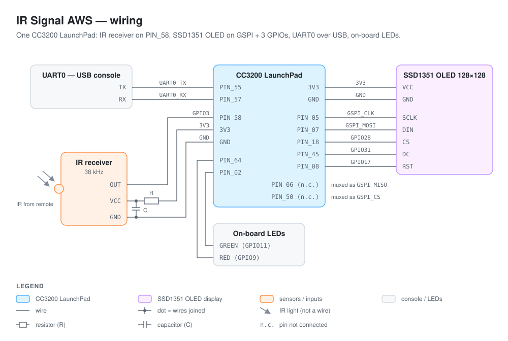
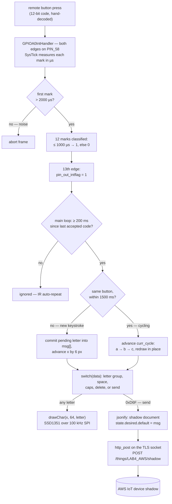

# IR Signal AWS

A TV remote becomes a keyboard for the cloud. A **TI CC3200 LaunchPad** decodes button presses from an IR remote in a GPIO interrupt handler, turns them into **T9-style multi-tap text** on a **128×128 SSD1351 OLED**, and — on the press of a send key — POSTs the finished message to an **AWS IoT device shadow** over **TLS 1.2 with mutual certificate authentication**. One C file drives the whole loop: `main.c` owns the decoder, the text engine, the display updates, and the HTTPS client.

The interesting part isn't the HTTP POST — it's that there is **no IR decoder chip and no protocol library**. The demodulated IR line lands on a plain GPIO pin, an interrupt fires on **both edges**, and a free-running 40 ms SysTick timer acts as a stopwatch: each low pulse ("mark") is measured in microseconds and classified by width — longer than 2000 µs starts a frame, at most 1000 µs is a `1`, anything else is a `0`. Thirteen edges later a 12-bit button code exists, hand-decoded per button and written straight into a `switch` statement.

---



---

## Table of Contents

1. [How a Message Happens](#how-a-message-happens)
2. [Repository Map](#repository-map)
3. [The IR Decoder — Edges, Marks, and Twelve Bits](#the-ir-decoder--edges-marks-and-twelve-bits)
4. [The Multi-Tap Text Engine](#the-multi-tap-text-engine)
5. [The Display Path](#the-display-path)
6. [The Cloud Path — TLS to an AWS IoT Shadow](#the-cloud-path--tls-to-an-aws-iot-shadow)
7. [Build & Flash](#build--flash)
8. [Known Limitations & Sharp Edges](#known-limitations--sharp-edges)
9. [Provenance & Acknowledgments](#provenance--acknowledgments)

---

## How a Message Happens



The design splits cleanly at the `pin_out_intflag` boundary: everything above it runs inside interrupts at microsecond scale; everything below it is a polled main loop running at human typing speed. The two halves share exactly one flag and one 12-bit integer.

## Repository Map

```text
IRSignalAWS/
├── README.md                # you are here
├── SYSTEM-DESIGN.md         # the architecture-level view
├── docs/
│   └── wiring-diagram.svg   # the schematic embedded above
├── main.c                   # the application (671 lines): IR decode ISR, SysTick timing,
│                            #   multi-tap engine, OLED composition, jsonify + http_post/get
├── pin_mux_config.c/.h      # TI PinMux-generated pin muxing (generated 2/27/2025)
├── Adafruit_GFX.c/.h        # Adafruit graphics core, C port — drawChar, shapes, 128×128
├── Adafruit_OLED.c          # SSD1351 driver: SPI writeCommand/writeData + init sequence
├── Adafruit_SSD1351.h       # SSD1351 command set, display dimensions
├── glcdfont.h               # 5×7 ASCII bitmap font (the OLED's only typeface)
├── uart_if.c                # TI SDK UART console (Report/UART_PRINT plumbing)
├── utils/
│   ├── network_utils.c      # SimpleLink event handlers, Wi-Fi connect, TLS socket setup
│   └── network_utils.h      # cert paths on serial flash, SlDateTime, app-config globals
├── cc3200v1p32.cmd          # linker script — code and data both live entirely in SRAM
├── macros.ini_initial       # CC3200_SDK_ROOT placeholder consumed at CCS import
├── NewTargetConfiguration.ccxml  # debug-probe target config
├── .ccsproject / .cproject / .project  # Code Composer Studio project; links gpio_if.c,
│                            #   network_common.c, startup_ccs.c in from the CC3200 SDK
├── .launches/ / .settings/  # IDE debug configs (artifacts)
├── FILELIST.txt             # generated file listing (artifact)
└── Release/                 # local build output — lab4-pt3.bin/.out/.map (gitignored, not in the repo history)
```

## The IR Decoder — Edges, Marks, and Twelve Bits

The IR receiver's demodulated output idles high and pulls low for each burst of 38 kHz carrier. `GPIOA0IntHandler` in [main.c](main.c) is registered for **both edges** on GPIOA0 bit `0x8` (GPIO3, package pin `PIN_58`):

- **Falling edge** — a mark is starting. The handler writes `HWREG(NVIC_ST_CURRENT) = 1`, which resets the SysTick countdown (the CC3200 clears the counter on any write to that register), and zeroes `systick_cnt`. If no frame is in progress, it arms one: `reading_data = true`, `edge_counter = 0`, `data = 0`.
- **Rising edge** — the mark just ended. Its width is `TICKS_TO_US(SYSTICK_RELOAD_VAL - SysTickValueGet())` — the reload value is 3,200,000 ticks at the CC3200's fixed 80 MHz clock, a 40 ms period. Edge 0 is the start bit: a mark of 2000 µs or less is rejected as noise and the frame is aborted. Edges 1–12 each shift `data` left and OR in a `1` when the mark was ≤ 1000 µs. At `edge_counter == 13` the frame is complete: `pin_out_intflag = 1`.

That's the whole protocol layer — a pulse-width classifier, not a named-protocol decoder. The 12-bit codes for each button (`0x7EF` = ABC, `0xBEF` = DEF, … `0x22F` = delete, `0xD6F` = send) were **decoded by hand** — the comment block at the top of `main.c` records the raw binary per button — so a different remote means re-deriving the table. (The previous README described this as an NEC decoder; the frame the code actually parses — a &gt;2 ms start mark plus 12 bits classified by mark width — is closer to Sony-SIRC-style coding than to NEC, which encodes bits in the *gaps*.)

A second SysTick client, `SysTickHandler`, increments `global_time` by 40 (ms) per rollover. That coarse clock drives the two debounce rules in the main loop: a decoded frame arriving **within 200 ms** of the last accepted one is discarded as IR auto-repeat, and a same-button press **after 1500 ms** is a new keystroke rather than a multi-tap cycle.

## The Multi-Tap Text Engine

The engine is a commit-on-next-press design built from four variables: `curr_letter` (the letter currently being cycled), `curr_cycle` (position within the button's letter group), `msg[50]` (the committed message), and `x` (the OLED cursor column).

- **A different button, or the same button after 1500 ms** → the *pending* letter is first appended to `msg` and `x` advances by 6 px; then the new button seeds a fresh cycle at its group's first letter.
- **The same button within 1500 ms** → `curr_cycle++`, and the letter is recomputed as `'a' + curr_cycle % group_size` (`% 4` for PQRS and WXYZ, `% 3` for the rest), redrawn in the same cell — the classic a→b→c rotation.
- **Caps lock (`0xFEF`)** subtracts 32 from the letter (`caps_lock * 32`) and toggles on each press; the toggle press itself also commits whatever letter was pending.
- **Delete (`0x22F`)** truncates `msg`, steps `x` back 6 px, and draws a space over the abandoned cell.
- **Send (`0xD6F`)** commits the pending letter, wraps `msg` in a shadow JSON document, and fires `http_post`. The next keystroke after a send erases the message row (`fillRect(0, 64, 128, 9)`) and starts fresh.

A subtle consequence of commit-on-next-press: a letter only truly enters `msg` when its *successor* arrives. The send key counts as a successor, so the last letter is never lost — but until you press something, the letter on screen is provisional.

## The Display Path

The display stack is three layers deep, all polled, no framebuffer:

1. [Adafruit_GFX.c](Adafruit_GFX.c) — geometry and text. `drawChar` renders a 5×7 glyph from [glcdfont.h](glcdfont.h) into a 6×8 cell, pixel by pixel, painting background pixels too (which is what makes redraw-in-place work during multi-tap cycling).
2. [Adafruit_OLED.c](Adafruit_OLED.c) — the SSD1351 driver. `writeCommand`/`writeData` frame every byte with the DC line (GPIO31/`PIN_45` low = command, high = data) and a chip select on GPIO28/`PIN_18`; `Adafruit_Init` runs the panel's full bring-up sequence after a reset pulse on GPIO17/`PIN_08`.
3. The GSPI peripheral — configured in `main.c` at **100 kHz**, mode 0, 8-bit words, software-controlled CS, with clock on `PIN_05` and MOSI on `PIN_07`.

At 100 kHz, a full-screen fill is 128×128×2 = 32,768 data bytes — over 2.5 seconds of pure SPI shifting — which is why the application never clears the whole screen after boot: it repaints only the 128×9 px message row.

## The Cloud Path — TLS to an AWS IoT Shadow

[utils/network_utils.c](utils/network_utils.c) (course-provided scaffolding) does the heavy lifting through the CC3200's SimpleLink network processor: reset-to-defaults, station-mode Wi-Fi join (credentials come from the SDK's `common.h`, *not* this repo), then `tls_connect()` — a **TLS 1.2** socket pinned to the `ECDHE-RSA-AES128-CBC-SHA256` cipher, loaded with three files from the CC3200's serial flash: `/cert/rootCA.der` (Starfield root, per the header comment), `/cert/client.der`, and `/cert/private.der`. That's **mutual TLS**, as AWS IoT requires; the device's identity is a flashed certificate, not a password.

`main.c` then speaks minimal hand-rolled HTTP on that socket. `jsonify` wraps the typed message into a shadow update — `{"state": {"desired": {"default": "<msg>"}}}` — and `http_post` assembles `POST /things/LAB4_AWS/shadow` with a `Host:` header naming the AWS IoT ATS endpoint, a computed `Content-Length`, and the JSON body, then sends and prints the response. The green on-board LED (GPIO11/`PIN_02`) reports a successful TLS connect, the red one (GPIO9/`PIN_64`) any network failure. `set_time()` seeds the device clock from compile-time macros because certificate validation needs a plausible date — the `NEED TO UPDATE THIS FOR IT TO WORK!` comment is not joking.

## Build & Flash

This is embedded firmware — you need real hardware and TI's toolchain, honestly:

- **A CC3200 LaunchPad** (the previous README records testing on Rev 4.2), an SSD1351 128×128 OLED, and a 38 kHz IR receiver plus a compatible remote
- **Code Composer Studio** with the TI ARM compiler (the project was built with the TMS470 20.2 toolchain, optimization off)
- **CC3200 SDK 1.5.0** — the project links `gpio_if.c`, `network_common.c`, and `startup_ccs.c` directly out of the SDK tree via the `CC3200_SDK_ROOT` path variable (`macros.ini_initial` holds the placeholder you fill at import; the committed `.project` points at `/Applications/TI/lib/cc3200sdk_1.5.0/cc3200-sdk`)
- **TI UniFlash** to write the client certificate, private key, and root CA to serial flash as user files at the `/cert/*.der` paths
- **An AWS IoT thing** with a shadow — and edits to `SERVER_NAME`, `POSTHEADER`, and `HOSTHEADER` in `main.c`, which are hardcoded to the original deployment
- **A 2.4 GHz Wi-Fi network**, with the SSID and key set in the SDK's `example/common/common.h`

Import (`File → Import → CCS Projects`), set `CC3200_SDK_ROOT`, update the date macros in `main.c`, build, and debug onto the board. On boot the UART0 console (`PIN_55`/`PIN_57`, over the LaunchPad's USB bridge) prints the `SSL + IR Decoding` banner, `My terminal works!`, then the Wi-Fi/TLS progress log. Note the linker script places *everything* in SRAM (code at `0x20004000`, 76 KB; data at `0x20017000`, 100 KB) — the program runs from RAM, loaded by the bootloader.

## Known Limitations & Sharp Edges

Honest notes — some are scope decisions, several are latent bugs the demo never hit:

- **The AWS endpoint is hardcoded to one account.** `SERVER_NAME` is a raw IP (`52.25.173.10`), the port macro is still called `GOOGLE_DST_PORT` (8443 — a leftover from the TI SSL demo this grew from), and the `Host:` header names a specific ATS endpoint with thing `LAB4_AWS`. None of it is configuration; all of it is `#define`s.
- **`set_time()` scrambles its fields.** `tm_sec` gets `HOUR`, `tm_hour` gets `MINUTE`, `tm_min` gets `SECOND` — the device clock is set to 18:00:12 instead of 12:18:00. It only matters because TLS certificate validation needs the date to fall in the cert's validity window, which the (correct) day/month/year fields satisfy.
- **`msg[50]` has no bounds check.** The 50th committed character writes past the buffer into neighboring globals. The display stops showing characters after ~21 anyway (`drawChar` clips once `x` passes the right edge), so the overflow is invisible when it happens.
- **`acRecvbuff[lRetVal+1] = '\0'`** terminates the HTTP response one byte too far — index `lRetVal` keeps whatever garbage was there, and a full 1460-byte receive writes out of bounds. Should be `[lRetVal]`.
- **The outgoing request is printed as a format string.** `UART_PRINT(acSendBuff)` hands the whole HTTP request — including the user-typed message — to a printf-style function. Type a `%` on the remote and the debug console misbehaves.
- **A failed TLS connect is not fatal.** `tls_connect()` errors are printed and execution continues; the eventual `http_post` is called with a negative number where a socket ID belongs.
- **Marks longer than 40 ms alias.** The ISR measures each mark within a single SysTick period and never consults `systick_cnt`, so a pulse spanning a rollover reads as a short one. Real remotes never produce one that long, but the decoder can't tell.
- **`http_get` is dead code** — a complete, working shadow-GET twin of `http_post` that nothing calls. In the same family: `jsonify` bakes a trailing `\r\n\r\n` *into the JSON body* (and `Content-Length` counts it), and `http_post` writes a header-terminating blank line that the very next `strcpy` overwrites because the write never advanced the pointer. AWS tolerates all of it.
- **The OLED driver's comments disagree with its code.** The init comment says RESET is on "GPIO28, pin 18" — in this build GPIO28 is the *chip select* and reset is GPIO17/`PIN_08`. Trust the `GPIOPinWrite` calls (and the wiring diagram above), not the comment. Similarly, the hardware CS pin (`PIN_50`) is muxed and toggled by the SPI driver, but the display's actual CS is the GPIO — both wiggle, only one is wired.
- **`Release/` exists only in the local working tree** — `.gitignore` excludes it, so a clone of the repo won't contain `lab4-pt3.bin`/`.out`/`.map`. Treat them as local build output, not source.

## Provenance & Acknowledgments

This is coursework: **EEC 172 (UC Davis)** lab work — the CCS project metadata records its origin as the course's `lab4/SSL_REST_API_AWS` scaffolding (project name `lab4-pt3`, launch configs `lab4-pt1`/`lab4-pt3`, application version string `WQ25`). Provided scaffolding: [utils/network_utils.c](utils/network_utils.c)/[.h](utils/network_utils.h) (authored by `rtsang`, course staff — the SimpleLink event handlers, Wi-Fi bring-up, and TLS socket plumbing), [uart_if.c](uart_if.c) and the linker script from TI's CC3200 SDK, and the Adafruit graphics port ([Adafruit_GFX.c](Adafruit_GFX.c), [glcdfont.h](glcdfont.h), [Adafruit_SSD1351.h](Adafruit_SSD1351.h)). The project-authored work is [main.c](main.c) — the edge-timed IR decoder, the multi-tap engine, the shadow JSON + HTTP client — plus the `TODO 1–3` SPI implementations (`writeCommand`, `writeData`, init wiring) filled in inside [Adafruit_OLED.c](Adafruit_OLED.c), and [pin_mux_config.c](pin_mux_config.c) generated for this pinout with TI PinMux.

- **Adafruit Industries** — the GFX and SSD1351 libraries this display stack is ported from (BSD license)
- **Texas Instruments** — CC3200 platform, SDK 1.5.0, driverlib, and Code Composer Studio (TI license)
- **AWS** — IoT Core device shadows and the mutual-TLS device model

The previous README declared project-specific code MIT-licensed; there is no standalone LICENSE file in the repo.

See [SYSTEM-DESIGN.md](SYSTEM-DESIGN.md) for the architecture-level view: the full data-flow diagram, the ideas behind the design, and the numbers that matter.
