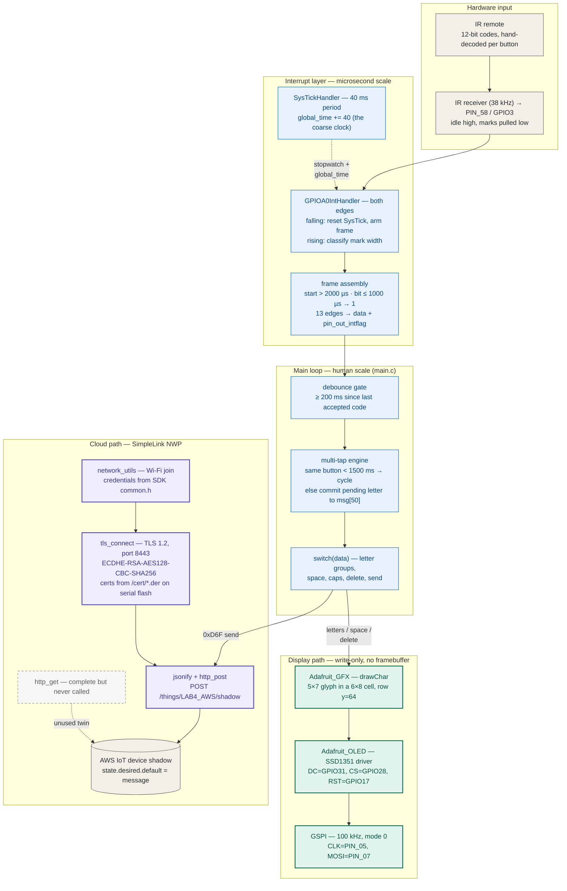
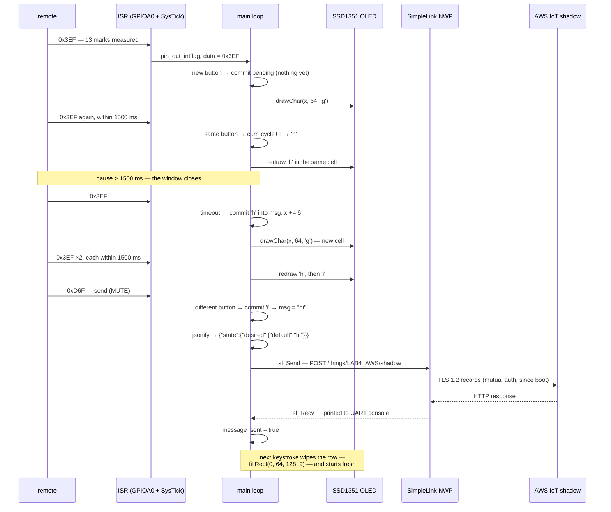

# IR Signal AWS — system design

> How a thumb on a TV remote becomes a JSON document in the cloud.
>
> An IR receiver demodulates the 38 kHz carrier and wiggles one GPIO pin. An
> interrupt fires on **both edges**; a free-running 40 ms SysTick acts as the
> stopwatch that turns each low pulse into a microsecond width, and thirteen
> edges later a hand-decoded **12-bit button code** exists. A polled main loop
> debounces it, runs a **commit-on-next-press multi-tap engine**, and paints
> each provisional letter onto a 128×128 SSD1351 over a 100 kHz SPI link.
> The send key wraps the finished message in an AWS IoT **shadow document**
> and pushes it through a **mutual-TLS 1.2 socket** held open since boot —
> the whole pipeline is one C file, two interrupt handlers, and a while(1).

This document is the developer-facing map of the whole system — every
component and how data moves between them. The companion [README](README.md)
covers per-layer detail, building, flashing, and the sharp edges in full;
the physical hookup is in the [wiring diagram](docs/wiring-diagram.svg).

---

## End-to-end flowchart



**Legend** — ⬜ hardware / external data · 🟦 interrupt layer + main loop ·
🟩 display path · 🟪 cloud path · ◌ dashed = present but unwired
(`http_get` compiles, links, and is never called).

---

## How to read it: the three ideas that matter

1. **All timing knowledge lives in one ISR and one counter.** There is no
   protocol library and no capture peripheral: the SysTick timer — nominally
   just a 40 ms heartbeat — doubles as a stopwatch because the falling-edge
   handler resets it (`HWREG(NVIC_ST_CURRENT) = 1`) and the rising-edge
   handler reads what's left. One subtraction and the `TICKS_TO_US` macro
   turn 80 MHz ticks into a mark width; two thresholds (2000 µs start,
   1000 µs bit boundary) turn widths into bits. The same timer's rollover
   handler increments `global_time` in 40 ms steps, and *that* clock drives
   everything at human scale: the 200 ms auto-repeat filter and the 1500 ms
   multi-tap window. Microseconds and milliseconds, one piece of silicon.

2. **The letter on screen is a proposal; the message is committed by the
   *next* press.** The multi-tap engine never commits the letter you're
   looking at. Cycling a→b→c just redraws the same OLED cell; the letter
   enters `msg[]` only when a *different* button arrives (or the same one
   after 1500 ms of silence). This is why send works without a race: `0xD6F`
   is itself "a different button", so it commits the pending letter before
   `jsonify` runs. The elegant consequence is that backspace, caps, and send
   all reuse one code path — the commit check at the top of the loop —
   guarded by a three-way `prev_data` exclusion so control keys don't commit
   themselves as letters.

3. **Everything slow is delegated to hardware that already knows how.** The
   CC3200's network coprocessor (the SimpleLink NWP) owns Wi-Fi, DNS, TCP,
   and the entire TLS handshake — the application just sets socket options
   (method TLSv1.2, one pinned cipher, three certificate files on serial
   flash) and calls `sl_Send`. Likewise the SSD1351 owns its own pixel RAM,
   so there is no framebuffer in the MCU: `drawChar` streams 48 pixels per
   glyph and the panel remembers them. What remains on the Cortex-M4 is glue
   logic running at typing speed — which is why a 100 kHz SPI bus and an
   unoptimized build are fast enough.

---

## Deep dive 1 — typing "hi", end to end

The GHI button (`0x3EF`) carries all three letters, so "hi" exercises every
rule the engine has: cycling, the 1500 ms window, and commit-on-next-press.



Worth noticing: the display work happens on *every* press but the network is
touched only on send — and the TLS socket used is the one `tls_connect()`
opened at boot, kept alive by the `Connection: Keep-Alive` header. There is
no reconnect path; if that socket ever dies, every subsequent send fails
with a red LED (see the sharp edges).

## Deep dive 2 — anatomy of an IR frame

```text
IR receiver output (idle high; each 38 kHz burst pulls it low)

 ────┐             ┌───┐      ┌─┐          ┌──────┐      ┌─ ─ ─
     │  start mark │gap│ mark │…│   mark   │ gap  │ mark
     └─────────────┘   └──────┘ └──────────┘      └──────┘
      > 2000 µs         > 1000 µs = '0'     ≤ 1000 µs = '1'

      ▲falling edge                ▲rising edge
      HWREG(NVIC_ST_CURRENT)=1     delta = TICKS_TO_US(
      (SysTick becomes a             3,200,000 − SysTickValueGet())
       stopwatch; arm frame
       if not reading_data)

  edge_counter:   0 ── start-bit check (abort frame if ≤ 2000 µs)
                  1…12 ── data <<= 1;  data |= (delta ≤ 1000 µs)
                  13 ── pin_out_intflag = 1;  frame complete

  data = 12-bit code, e.g. 0x3EF = 0011 1110 1111 (button 4, GHI)
```

Two properties fall out of this shape. First, the decoder is
**protocol-agnostic**: nothing in the code names NEC or SIRC — it is a
mark-width classifier whose thresholds happen to fit the lab remote, and the
per-button codes in the `main.c` comment block were captured by hand.
Second, the gaps between marks are *never measured* — only lows are timed —
so the decoder is immune to gap jitter but blind to any protocol that
encodes bits in the spaces (which is exactly what NEC does; this is why the
old README's "NEC decoder" label didn't survive contact with the source).

---

## Component inventory

| Component | Layer | Provenance | Where |
|---|---|---|---|
| IR pulse-width decoder (`GPIOA0IntHandler`, SysTick plumbing) | Input | ✅ implemented here | [main.c](main.c) |
| Multi-tap engine, debounce, message state | Application | ✅ implemented here | [main.c](main.c) |
| `jsonify`, `http_post`, `http_get`, `set_time` | Cloud (app side) | ✅ implemented here, on the TI SSL-demo skeleton | [main.c](main.c) |
| SPI byte layer + panel bring-up (the lab's `TODO 1–3`) | Display | ✅ implemented here | [Adafruit_OLED.c](Adafruit_OLED.c) |
| Graphics primitives, `drawChar`, 5×7 font | Display | Adafruit C port (third-party) | [Adafruit_GFX.c](Adafruit_GFX.c) / [glcdfont.h](glcdfont.h) |
| Wi-Fi join, TLS socket, SimpleLink event handlers | Cloud (transport) | course scaffolding (`rtsang`) | [utils/network_utils.c](utils/network_utils.c) |
| Cert paths, app-config globals, `SlDateTime` | Cloud (transport) | course scaffolding | [utils/network_utils.h](utils/network_utils.h) |
| UART console (`Report` / `UART_PRINT`) | Debug | TI SDK scaffolding | [uart_if.c](uart_if.c) |
| Pin muxing (SPI, UART0, GPIO in/out) | Board | TI PinMux, generated 2/27/2025 | [pin_mux_config.c](pin_mux_config.c) |
| All-SRAM memory map | Build | TI SDK scaffolding | [cc3200v1p32.cmd](cc3200v1p32.cmd) |
| CCS project — links `gpio_if.c`, `network_common.c`, `startup_ccs.c` from the SDK | Build | course scaffolding | `.project` / `.cproject` |
| `lab4-pt3.bin` / `.out` / `.map` | — | ⬜ local build artifacts (gitignored) | `Release/` |

---

## The numbers that matter

| Value | What it is |
|---|---|
| 80 MHz | the CC3200's fixed clock (`SYSCLKFREQ`) — the unit behind every timing macro |
| 3,200,000 / 40 ms | SysTick reload value / period; also the granularity of `global_time` |
| > 2000 µs | mark width that starts a frame (shorter start bits abort it) |
| ≤ 1000 µs | mark width classified as a `1` bit |
| 13 / 12 | rising edges per frame / data bits per button code |
| 200 ms | window in which a repeated frame is discarded as IR auto-repeat |
| 1500 ms | multi-tap window — same button inside it cycles, outside it commits |
| 100 kHz | SPI bit rate to the OLED (`SPI_IF_BIT_RATE`) — a full-screen fill is 32,768 data bytes, > 2.5 s |
| 128×128 / 6×8 px / y = 64 | panel size / character cell / the one message row the app repaints |
| ~21 | characters that fit on the row before `drawChar` clips (128 / 6) |
| 50 / 256 / 512 / 1460 | bytes: `msg` buffer / JSON buffer / HTTP send buffer / HTTP receive buffer |
| 8443 | TLS port (`GOOGLE_DST_PORT` — the name is a leftover from the TI demo) |
| TLSv1.2 + ECDHE-RSA-AES128-CBC-SHA256 | pinned socket method and the single enabled cipher |
| 3 | certificate files on serial flash: `/cert/rootCA.der`, `/cert/client.der`, `/cert/private.der` |
| 0x13000 / 0x19000 | SRAM code region (76 KB @ 0x20004000) / data region (100 KB @ 0x20017000) — no flash execution |

---

## Verification status

There are **no automated tests** — no unit tests, no harness, no CI. The
system was validated the way lab firmware is: live on hardware (the previous
README records a CC3200 LaunchPad Rev 4.2). The observable checkpoints, in
boot order:

| Stage | Evidence |
|---|---|
| Firmware built | `Release/lab4-pt3.bin` / `.out` / `.map` exist in the local working tree (gitignored, so absent from a clone) — a successful TI-toolchain build on the development machine |
| Board + console up | UART0 banner (`SSL + IR Decoding`), then `My terminal works!` |
| Wi-Fi joined | SimpleLink event log on the console; blinking then solid IP-acquired LED |
| TLS established | `Device has connected to the website:` + **green LED** (GPIO11); failures latch the **red LED** (GPIO9) |
| IR decode works | each accepted frame draws a letter at row 64 of the OLED |
| Cloud round trip | `http_post` prints the request and AWS's HTTP response to the console; the shadow's `state.desired.default` is inspectable in the AWS IoT console |

That is the entire safety net. Regressions announce themselves as a frozen
display, a red LED, or a shadow that stopped changing.

---

## Design trade-offs & sharp edges

- **Pulse-width classification over protocol decoding** — two thresholds
  instead of a protocol state machine; trivially robust for the one remote
  it was tuned against, and useless for any remote whose codes weren't
  hand-captured into the `switch`. The decoder also measures only within a
  single 40 ms SysTick period (`systick_cnt` is maintained but never
  consulted in the width math), so a mark spanning a rollover aliases short.
- **Commit-on-next-press over commit-on-timeout** — no timer callback, no
  pending-letter expiry; the cost is that the last letter of a message is
  provisional until send arrives (which conveniently counts as the next
  press), and the first-ever keystroke commits the initial NUL `curr_letter`
  — harmless, since appending `'\0'` doesn't change `strlen`, but it does
  advance the cursor one blank cell.
- **A flag and a shared int over a queue** — the ISR and main loop
  communicate through `pin_out_intflag` and the single volatile `data`. If a
  second frame completes before the loop consumes the first, the first is
  silently overwritten; at human button-press rates (with the 200 ms filter
  in front) this never bites, but there is no interrupt masking or critical
  section protecting the handoff.
- **One TLS socket for the process lifetime** — `tls_connect()` runs once at
  boot; `http_post` reuses the socket forever with `Connection: Keep-Alive`.
  There is no reconnect, and a failed connect isn't even fatal: the code
  presses on and later hands a negative error where a socket ID belongs.
- **Identity is compiled and flashed, not configured** — endpoint IP, host
  header, thing name, and date macros live in `#define`s; Wi-Fi credentials
  live in the *SDK's* `common.h` outside the repo; the device certificate
  and key live on serial flash. Nothing sensitive is committed (good), but
  reproducing the setup means touching four different places (see the
  README's [Build & Flash](README.md#build--flash)).
- **All-SRAM execution** — the linker script puts vectors, code, and data in
  RAM; the bootloader loads the image from serial flash on reset. Simple and
  fast, with hard ceilings: 76 KB of code, 100 KB of data, and the
  `printf_support=full` runtime already on board.
- **Latent buffer bugs the demo never hit** — `msg[50]` unbounded append,
  the `acRecvbuff[lRetVal+1]` off-by-one, and the format-string
  `UART_PRINT(acSendBuff)` are all documented with failure conditions in the
  README's [sharp edges](README.md#known-limitations--sharp-edges).

---

## Provenance

**EEC 172 (UC Davis)** lab firmware — the CCS metadata records the project's
origin in the course's `lab4/SSL_REST_API_AWS` scaffolding (project
`lab4-pt3`, version string `WQ25`, pin mux generated 2/27/2025). Course
scaffolding provided the network layer ([utils/network_utils.c](utils/network_utils.c),
authored by `rtsang`), the TI SDK glue (`uart_if.c`, linker script, and the
SDK-linked `gpio_if.c` / `network_common.c` / `startup_ccs.c`), and the
Adafruit graphics port. Implemented on top of it: the edge-timed IR decoder
and SysTick stopwatch, the multi-tap text engine, the shadow JSON + HTTP
client in [main.c](main.c), and the SPI/OLED bring-up (`TODO 1–3`) in
[Adafruit_OLED.c](Adafruit_OLED.c). Display libraries by
**Adafruit Industries** (BSD); platform, SDK 1.5.0, and toolchain by
**Texas Instruments**; cloud side is **AWS IoT Core** device shadows.
